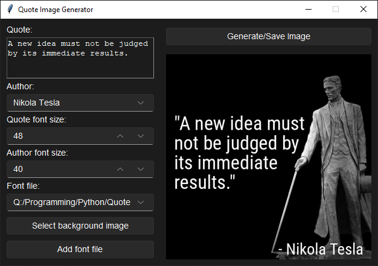

# Quote Image Generator

A Python application that generates beautiful quote images with custom fonts, backgrounds, and styling options. The tool consists of a FastAPI backend for image processing and a Tkinter-based GUI for easy interaction.

## Features

- Generate quote images with custom text and author attribution
- Customizable font sizes for both quote and author text
- Support for custom font files (TTF)
- Background image selection per author
- Automatic text wrapping and centering
- Shadow effects for better text readability
- Multiple save options (manual and automatic naming)
- Dark/light theme support

## Screenshots

  
*The main application interface with an example of a generated quote image*

## Installation

1. Clone the repository:
   ```bash
   git clone https://github.com/yourusername/quote-image-generator.git
   cd quote-image-generator
   ```

2. Install the required dependencies:
   ```bash
   pip install -r requirements.txt
   ```

3. Run the application:
   ```bash
   python gui.py
   ```

## Requirements

- Python 3.7+
- Pillow (PIL)
- FastAPI
- Uvicorn
- Requests
- Tkinter
- sv_ttk (for theme support)
- pywinstyles (Windows titlebar styling)